#  Real-time synchronize human movement in augmented reality

Powered by Jialin Li, Dr. Fenghe Hu and Dr. Yansha Deng.

Jialin Li: jialin.li.kcl@outlook.com

## Overview

This project attempts to develop programs that make mobile devices display human movements in AR synchronously, and all information transmission is based on wireless networks.

As a result, many technologies were combined to realise this project, and the mid-server was deployed on the Azure platform. At the end, we tested the size and transit delay of each data segment. However, the method implemented still needs to be improved, and more advanced functions can be developed in the mid-server.

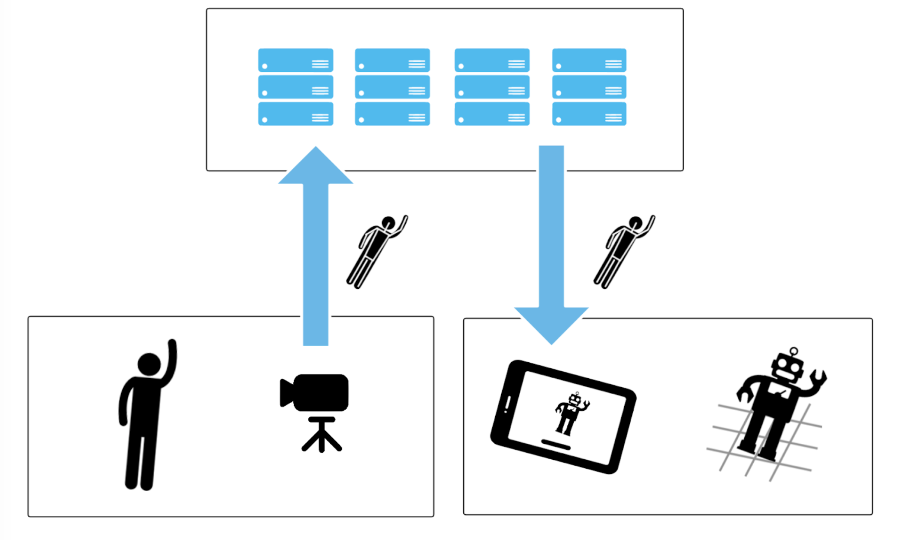

## Objectives

Although many applications could reconstruct human skeletons from 2D images, these solutions are not suitable for 3D scenes or need to combine multiple 2D cameras to reconstruct spatial information. Even many solutions require the purchase of expensive enterprise-level commercial licenses and cannot be re-developed. The objectives of this article are to find a more versatile, faster and lower-cost technology to achieve "motion capture - transmission - AR reconstruction" on mobile devices. Furthermore, find a reliable transmission method to synchronize the movements of the human body and the model skeleton.


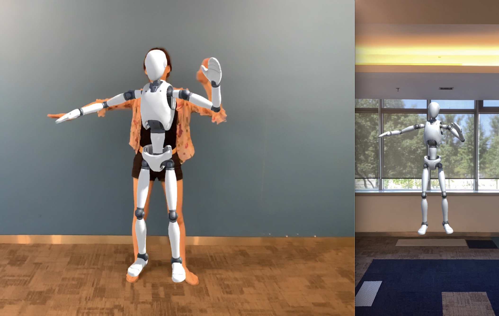

## Tech Dependencies

* Apple A12 Bionic (or higher)
* Unity 2020.1
* Best Http/2.0
* Node 12.18
* Local router or Azure app service (for Mid-server)
* Repo of [Unity ARFoundation Example](https://github.com/Unity-Technologies/arfoundation-samples)

## MileStones

1) Develop a human skeleton collection program to collect the skeleton information from human and send it to the mid-datacenter
2) The mid-datacenter receives the skeleton information, and periodically sends the data to the display device
3) The display-device receives the skeleton information sent by the mid-datacenter, analyses it and puts it into the developed AR program
4) Display the human-liked model in AR and update each point position in skeleton according to the obtained skeleton data
5) Test the availability of the pipeline under wifi and 4G networks

## General Structure

In order to achieve the expected goals, the project has constructed multiple programs, which are combined to realize the designed scenarios. Figure indicates how all devices works and the system contains:
* Collecting Program: (must run on A12 Bionic Chip) is responsible for capturing human body work and sending it to Mid-server
* Receiving Program: Responsible for receiving messages sent by mid-server, generating virtual models in AR space, and synchronizing actions
* Mid-Server: Responsible for receiving and sending messages, and also provides speed control and data statistics

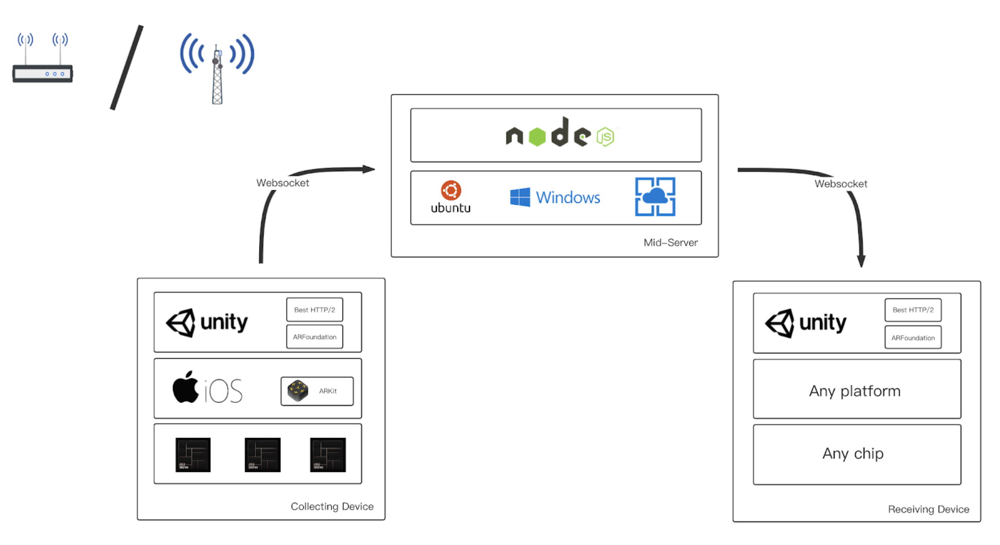


## Implement

### Deployment Architect

Two deployment structures are used in this project, namely, a local server based on a local area network and an Azure cloud server based on the 4G network. They are designed to solve communication issues under different environments.

On the client side, two mobile devices are included in the project, and they serve as the collector and receiver respectively. Both the collecting device and the receiving device must support the Unity platform. The collecting device must be based on the Apple A12 Bionic chip (or A12X Bionic chip), and the receiving device has no chip requirements. The local server uses the Linux operating system, and Node.js V12+ can be deployed. Azure App Service supports Node.js V12 as a virtual server as well.

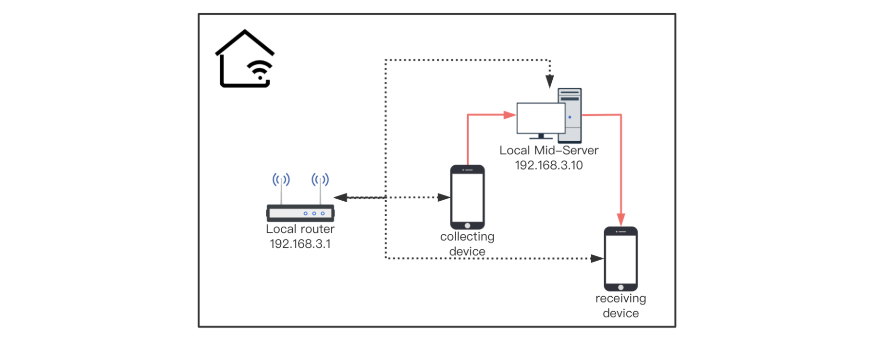

In this project, Huawei WS5200 router is used to build a local area network, with 4 independent chip cores. The local server is a 2017 Apple Macbook Pro Laptop, 2.3GHz dual-core CPU and 8GB DDR3 memory. Generally speaking, it has powerful performance.The WS5200 router supports both 2.4G and 5G communication modes. In order to ensure the best performance,  2.4G band, with lower frequency, is forbidden so that all deployments are based on the 5G frequency band. When the collecting device and the receiving device are working in the same Wi-Fi network under WS5200, the message can be forwarded to the receiving device by the router via this Wi-Fi network
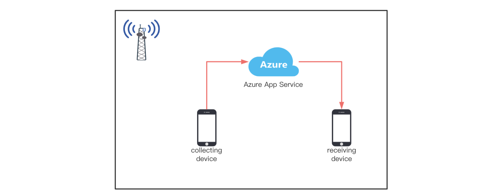

In the architecture of 'Azure + 4G network', the 4G network in Shanghai is provided by China-Unicom, and Azure servers are deployed in eastern Asia where it is the closest region to China Mainland. Through the deployment of Azure, this project has achieved global access. Regardless of where the collecting device and the receiving device are located, they can connect to Azure and send or get messages via Azure service.


### AR Anchor

> ARAncho.unity is the Unity scene for receiving-device

The objective of this project is to enable the robot model in the receiver device to synchronize the actions in the AR space. It needs to display the robot model on the screen of the receiving device. At present, the space position coordinates of the robot model in the AR space will be forcibly set to 0. This means that the robot model will always stand at the origin in the AR space.

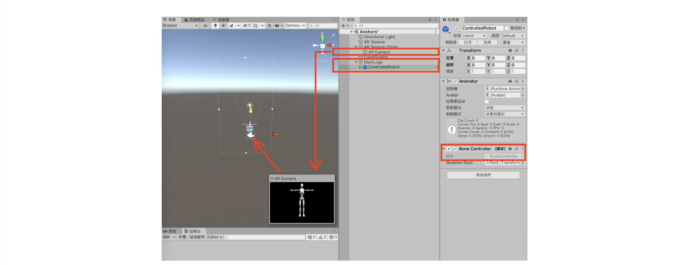

In figure, the AR camera and ControllerRobot are the main elements of the AR scene. In order to achieve this goal, first add two sub-objects, ARSession and ARsession Origin, to the new AR scene. These two sub-objects will run and load when the scene is created, and they will automatically call the API in the system to indicate that this is an AR scene. Next, add an AR Camera as the initial position of the phone camera. Because MainLogic needs to manipulate the robot model, the robot model is loaded as a sub-object of MainLogic to facilitate operation at runtime. After the scene is loaded and running, the stationary robot model is successfully loaded into the AR space. The control logic will be explained in the following sub-chapters.

### Skeleton Recognition and Tracking

> HumanBodyTracking3D.unity is the Unity scene for collecting-device

ARKit provides human tracking in version 3.5. All devices equipped with A12 Bionic could enable human tracking via ARKit3.5 API. Although developers do not need to implement human tracking algorithms by themselves, Apple's solution still has many restrictions on developers. First of all, ARkit's human tracking function does not provide specific implementation, so it cannot be optimized according to needs. In addition, the model structure of the human body tracking must be the same as the model structure required in the apple document.

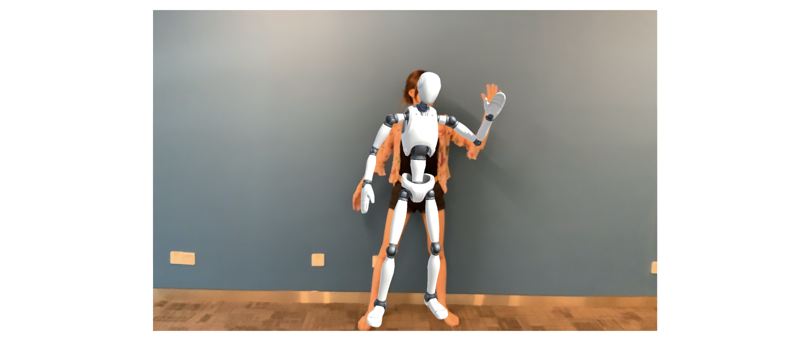

A mismatched structure may not be able to achieve any function or cause unknown problems in the program. Finally, the coordinate system in ARKit is the right-handed system, which is different from the left-handed system used by other developers. It means that the data returned in ARKit must be recalculated into new coordinates, once two coordinates are not suitable for each other. In a left-handed system, such as Unity, if the recognition result from ARKit is used directly, the mobile robot model cannot be effectively moved and the work of the collecting device cannot be synchronized (because the coordinate system does not match).

ARKit can track 90 joints in the skeleton. Although these 90 joints have corresponding names, these 90 joints are not exactly the same as anatomical joints. Root is a special node, which indicates the position of the robot model in the physical world. It has the same meaning as the hips_joint node, so the relative position of hips_joint and root must be 0. All nodes have a unique index, the index of the root node is 0 and the hips_joint node is 1. The relationship between each node is kept by parent nodes that are a series of integer mapping. For example, the parent node of hips_joint is root so that the mapping is 1 to 0. According to Apple's requirements, developers must use a model structure that meets Apple's requirements in the Unity space.

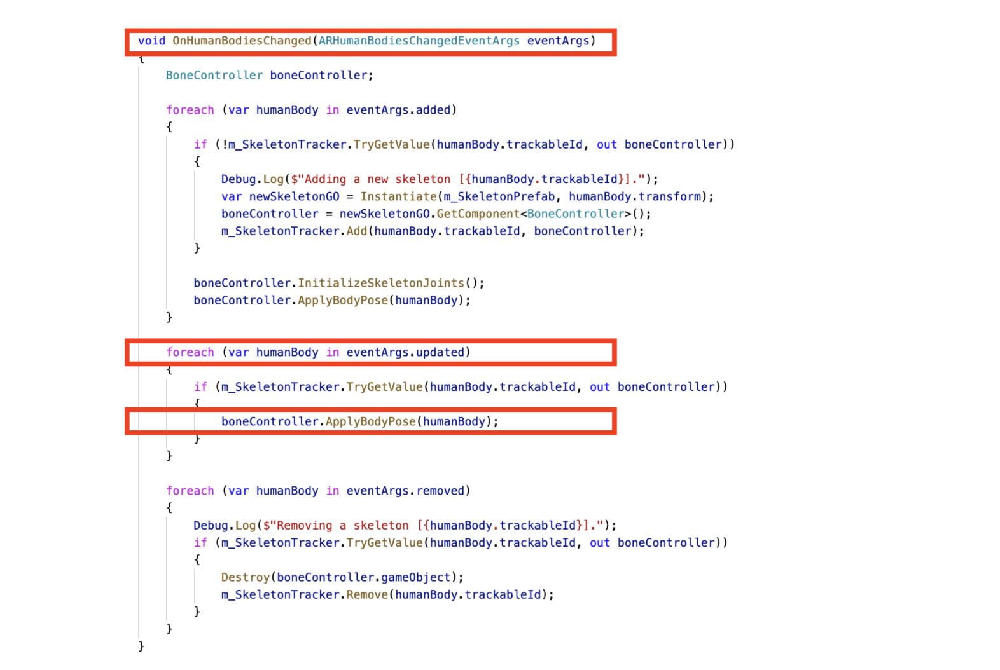

When the ARkit-based program is launched and loaded, ARKit will check whether the device is equipped with A12 Bionic. The most important thing in the configuration is the need to generate BodyTrackEntity and AnchorEntity. When the scene is fully loaded, first the developer needs to add the Anchor to the ARView, so that future AR objects can be placed in this Anchor.

ARKit will capture and recognize objects from the camera in each session. If the object can be recognized as a BodyAnchor, then it can be considered that there is human movement in front of the camera. Then the orientation and rotation of each joint of the robot model will be updated in this session, so that the robot model moves. This step is simplified in ARFoundation, when an update event is detected in the session. ARFoundation will use the BoneController provided by Unity to update the robot model.


### Send and Receive Messages

BestHttp is responsible for the network communication of the project. In websocket, there are many predefined actions. When the Websocket connection is established, the events-driven connection program will monitor event on the specified connection port. Once a message, or other event that can trigger operations, arrives such as establishing or disconnecting a connection, the program will trigger the specified operation.

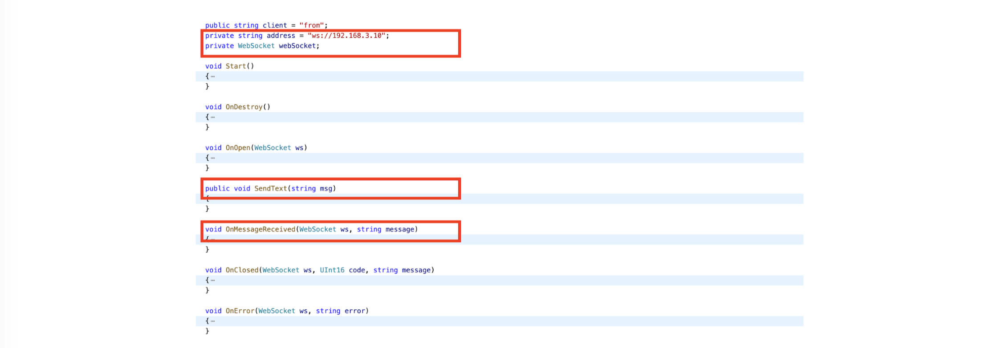

Figure Code for network communication
The main methods are OnOpen(), SendText() and OnMessageReceived(). When the websocket connection is created, the system will automatically call OnOpen(). In contrast, the OnMessageReceived() method will not run immediately, it will always wait for the event. Until the message from the server arrives, OnMessageReceived() will be triggered to process the message. Similarly, SendText() will send a message from the local client to the server. It will be forwarded by the server to the receiver, triggering the OnMessageReceived() method of the receiver.

OnOpen() will be triggered when the websocket is created, and it will first send a message named ‘client’ to the server. The ‘client’ message has only two values: "from" or "To". This value is used to indicate to the server whether the current device is the collector or receiver. The mid-server will receive the message and maintain the connection based on the value of ‘client’.

### Package and Unpackage Operation

Packing and unpacking operations are a set of opposite operations, which run on the collecting device and the receiving device respectively. In network communication, the message body is usually in String format, which means that only one message can be sent and received at a time.

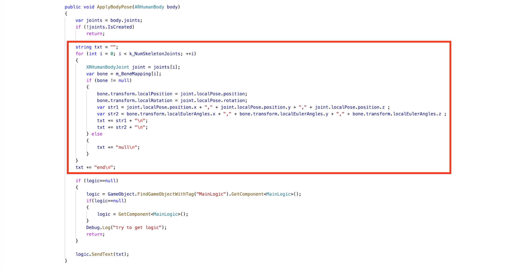

ApplyBodyPose() reorganizes the multi-array of skeleton coordination into a long string, and splits each joint with "," and "\n". After reorganizing, sendText() will be used to send the message to the mid-server at the end of ApplyBodyPose. After being forwarded by the mid-server, the message will eventually reach the receiving device. The receiving device receives the event, and then runs OnMessageReceived(), which calls the ApplyBonePoseFromServer() Method to parse the message. 

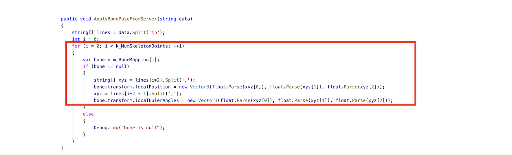

In ApplyBonePoseFromServer() method, the long string is decomposed into orientation and rotation, and written into the skeleton by unity according to the bonecontroller. Because unity can directly read the robot model, and the robot model has been adapted in the bonecontroller, the Index of each joint and the index information of the parent node have been registered in the unity.


### Flow control

Flow control is an effective control method, which is integrated in the mid-server to ensure the availability of the receiving device. Because the developer cannot control the speed of upgrade-session in the A12 chip, there is no guarantee that the upstream transmission is constant. Excessive traffic in a short period of time may cause problems with the display of the robot model in the receiving device, which means that the traffic incoming to the receiving end device must be controlled.

In the local server and Azure cloud server, the same function is set to limit the message sending speed. In setInterval(), the default transmission interval is set to 35ms, which is about 30 times per second. This is based on a callback function. When 35ms is over, the callback function will send the current message information in the connection.

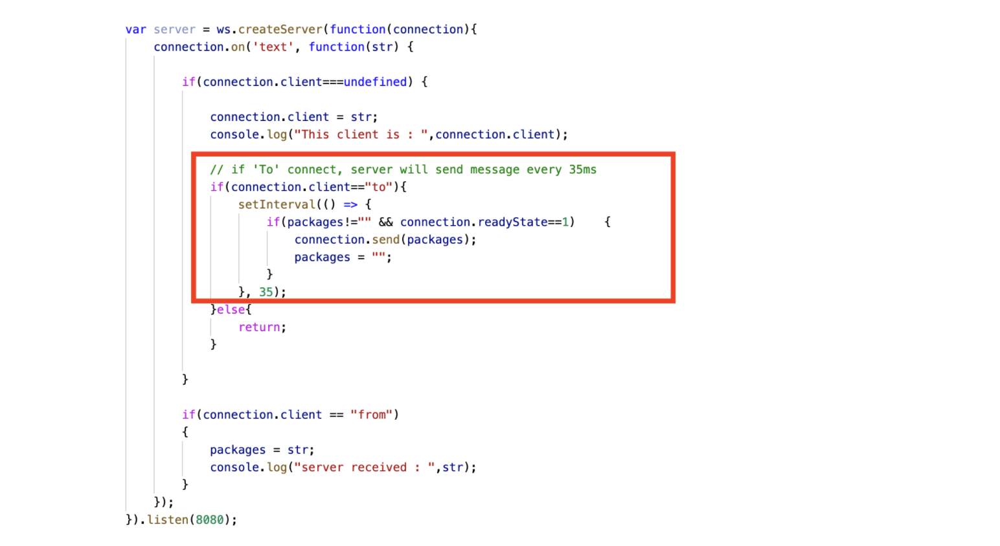

After the flow control, the robot model moves more smoothly without obvious delay or blockage. It successfully turned synchronous calls into asynchronous calls. When the device cannot run Unity smoothly due to hardware limitations, the mid-server can reduce the speed to avoid data squeeze on the client. After testing, this greatly relieves the operating pressure of the receiving device.

## Future Improvements

Although human body recognition can run smoothly and can be synchronised on another device, there are still some problems that need to be solved in the future. In this chapter, some future optimisation work will be discussed, and appropriate solutions will be given.

1）Channel problem. Currently, mid-server does not support the channel function and cannot provide services for multiple collection devices. At present, a server can only serve a set of devices, but cannot curate many devices working at the same time. If there are two collecting devices connected to the mid-server, the mid-server cannot distinguish which device the data comes from. The downstream receiving device will randomly get the information from the two collecting devices, rather than the two sets of devices separately obtaining their information. To achieve this function by keeping channels in mid-server, it is best to use some free technology to achieve this: for example, devices subscribe to the specified topic in the Azure SignalR service.

2）Synchronization problems caused by the robot model. At present, according to Apple's requirements, the restored robot must have the same model structure, with 90 joints. This means that the model is not very adaptable and cannot match all types of models (such as other characters). Since the local coordinate system is adopted by default, there is a very strong coupling between the 90 points. If only part of the joint information is transmitted, this will result in irreversible information loss. To solve this problem, an alternative idea is to keep only the Global coordinates of the key points instead of the local coordinates. Although unity must use local coordinates, developers can implement the restoration from global coordinates to local coordinates by themselves.


## Download and Execute

Client
```
git clone https://github.com/Unity-Technologies/arfoundation-samples

git clone <this repo>

delete arfoundation-samples/Assets/Scenes

copy Besthttp, Myscript and Scenes under <this repo>/Assets then paste in arfoundation-samples/Assets 

replace arfoundation-samples/Assets/Scripts/BoneController.cs by <this repo>/Assets/Scripts/BoneController.

open project by Unity and mark "Myscript/MainLogic.cs" with Unity-Tag "MainLogic"

Find the Robot (in Scene) and mark Robot with Unity-Tag "robot"

re-write server ip in mainlogic.cs

Export Scenes as IOS program and deploy on devices by XCode

ARAncho.unity is receiving-device program
HumanBodyTracking3D.unity is receiving-device program

```

Server
```
npm start
```
